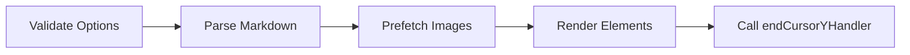

# MdTextRender

The primary function that renders Markdown content into a jsPDF document.

## Signature

```ts
function MdTextRender(
  doc: jsPDF,
  text: string,
  options: RenderOption
): Promise<void>
```

## Parameters

| Parameter | Type | Description |
|-----------|------|-------------|
| `doc` | `jsPDF` | An existing jsPDF document instance to render into |
| `text` | `string` | The raw Markdown content to render |
| `options` | [`RenderOption`](/api/options) | Configuration object controlling layout, fonts, and behavior |

## Return Value

Returns a `Promise<void>` that resolves when all markdown content has been rendered into the document. The function is `async` because it needs to:

1. Parse the markdown (using `marked` lexer)
2. Prefetch images (to determine dimensions)
3. Render all elements sequentially

## How It Works



1. **Validate options** — merges user options with defaults
2. **Parse markdown** — tokenizes the markdown string via `MdTextParser`
3. **Prefetch images** — loads all images to determine their dimensions
4. **Render elements** — iterates through parsed tokens, dispatching to the appropriate renderer (heading, paragraph, list, table, image, etc.)
5. **Callback** — calls `endCursorYHandler` with the final Y cursor position

## Usage

```ts
import { jsPDF } from 'jspdf'
import { MdTextRender } from 'jspdf-md-renderer'

const doc = new jsPDF({ unit: 'mm', format: 'a4' })

await MdTextRender(doc, '# Hello\n\nWorld', {
  cursor: { x: 10, y: 10 },
  page: {
    maxContentWidth: 190,
    maxContentHeight: 277,
    lineSpace: 1.5,
    defaultLineHeightFactor: 1.2,
    defaultFontSize: 12,
    defaultTitleFontSize: 14,
    topmargin: 10,
    xpading: 10,
    xmargin: 10,
    indent: 10,
  },
  font: {
    bold: { name: 'helvetica', style: 'bold' },
    regular: { name: 'helvetica', style: 'normal' },
    light: { name: 'helvetica', style: 'light' },
  },
  endCursorYHandler: (y) => console.log('Done at Y:', y),
})

doc.save('output.pdf')
```

## Supported Element Types

`MdTextRender` handles these token types internally:

| Token Type | Renderer | Description |
|------------|----------|-------------|
| `heading` | `renderHeading` | `#` through `######` |
| `paragraph` | `renderParagraph` | Plain text blocks |
| `list` | `renderList` | Ordered and unordered lists |
| `list_item` | `renderListItem` | Individual list items |
| `hr` | `renderHR` | Horizontal rules (`---`) |
| `code` | `renderCodeBlock` | Fenced code blocks |
| `strong` | `renderInlineText` | Bold text |
| `em` | `renderInlineText` | Italic text |
| `codespan` | `renderInlineText` | Inline code |
| `link` | `renderLink` | Hyperlinks |
| `blockquote` | `renderBlockquote` | Blockquotes |
| `image` | `renderImage` | Images with optional attributes |
| `table` | `renderTable` | GFM pipe tables |
| `text` / `raw` | `renderRawItem` | Raw text content |

Unsupported token types will log a warning to the console with a link to submit a GitHub issue.
