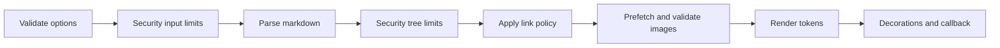

# MdTextRender

`MdTextRender` renders markdown into an existing `jsPDF` document.

## Signature

```ts
function MdTextRender(
  doc: jsPDF,
  text: string,
  options: RenderOption
): Promise<RenderResult>
```

Since 4.3 it resolves to a [`RenderResult`](/guide/render-result) rather than
`undefined`. Existing code that ignores the return value is unaffected.

## Parameters

| Parameter | Type | Description |
|-----------|------|-------------|
| `doc` | `jsPDF` | Existing jsPDF document instance |
| `text` | `string` | Raw markdown input |
| `options` | [`RenderOption`](/api/options) | Render and security configuration |

## Returns

```ts
interface RenderResult {
  endY: number              // cursor Y when rendering finished
  startPage: number         // page the render began on
  pageCount: number         // pages this render produced
  warnings: RenderWarning[] // everything that could not be drawn
  droppedNodes: number      // total nodes discarded
  violations: SecurityViolation[]
}
```

See [Render Result](/guide/render-result) for the warning codes and the
`silent` / `onWarning` options.

## Render Pipeline


```mermaid
flowchart LR
  A[Validate options] --> B[Security input limits]
  B --> C[Parse markdown]
  C --> D[Security tree limits]
  D --> E[Apply link policy]
  E --> F[Prefetch and validate images]
  F --> G[Render tokens]
  G --> H[Decorations and callback]
```

### Stage Notes

1. `validateOptions` normalizes defaults (including `security`).
2. `enforceMarkdownLimits` checks markdown length.
3. `MdTextParser` tokenizes markdown.
4. `enforceNestedDepthAndImageCount` sanitizes the parsed tree based on security limits.
5. `applyLinkPolicy` validates links and applies placeholder/skip behavior.
6. `prefetchImages` validates and loads image data.
7. Renderer dispatches token-by-token to component renderers, or to a caller's
   [component override](/guide/component-overrides) where one is supplied.
8. Page decorations are applied, `endCursorYHandler` receives the final cursor
   Y position, and the `RenderResult` is returned.

## Security Behavior

When `security.enabled` is `true`, `MdTextRender` can:
- block unsafe URLs and image sources
- enforce resource and structural limits
- switch behavior via `violationMode`

### Violation Modes

- `skip`: continue rendering but omit blocked content.
- `throw`: abort with `SecurityViolationError`.
- `placeholder`: replace blocked content with placeholder text where supported.

## Concurrency

`MdTextRender` is safe for concurrent usage across documents because render state is isolated per call.

## Example

```ts
import { jsPDF } from 'jspdf'
import { MdTextRender } from 'jspdf-md-renderer'

const doc = new jsPDF({ unit: 'mm', format: 'a4' })

const result = await MdTextRender(doc, '# Hello\n\nWorld', {
  page: { margin: { top: 20, right: 20, bottom: 20, left: 20 } },
  font: { regular: { name: 'helvetica', style: 'normal' } },
  security: {
    enabled: true,
    violationMode: 'skip',
  },
})

console.log('Done at Y:', result.endY)
if (result.warnings.length) console.warn(result.warnings)
```
