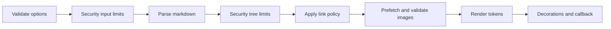

# MdTextRender

`MdTextRender` renders markdown into an existing `jsPDF` document.

## Signature

```ts
function MdTextRender(
  doc: jsPDF,
  text: string,
  options: RenderOption
): Promise<void>
```

## Parameters

| Parameter | Type | Description |
|-----------|------|-------------|
| `doc` | `jsPDF` | Existing jsPDF document instance |
| `text` | `string` | Raw markdown input |
| `options` | [`RenderOption`](/api/options) | Render and security configuration |

## Render Pipeline


```mermaid
flowchart LR
  A[Validate options] --> B[Security input limits]
  B --> C[Parse markdown]
  C --> D[Security tree limits]
  D --> E[Apply link policy]
  E --> F[Prefetch and validate images]
  F --> G[Render tokens]
  G --> H[Decorations and callback]
```

### Stage Notes

1. `validateOptions` normalizes defaults (including `security`).
2. `enforceMarkdownLimits` checks markdown length.
3. `MdTextParser` tokenizes markdown.
4. `enforceNestedDepthAndImageCount` sanitizes the parsed tree based on security limits.
5. `applyLinkPolicy` validates links and applies placeholder/skip behavior.
6. `prefetchImages` validates and loads image data.
7. Renderer dispatches token-by-token to component renderers.
8. `endCursorYHandler` receives final cursor Y position.

## Security Behavior

When `security.enabled` is `true`, `MdTextRender` can:
- block unsafe URLs and image sources
- enforce resource and structural limits
- switch behavior via `violationMode`

### Violation Modes

- `skip`: continue rendering but omit blocked content.
- `throw`: abort with `SecurityViolationError`.
- `placeholder`: replace blocked content with placeholder text where supported.

## Concurrency

`MdTextRender` is safe for concurrent usage across documents because render state is isolated per call.

## Example

```ts
import { jsPDF } from 'jspdf'
import { MdTextRender } from 'jspdf-md-renderer'

const doc = new jsPDF({ unit: 'mm', format: 'a4' })

await MdTextRender(doc, '# Hello\n\nWorld', {
  cursor: { x: 10, y: 10 },
  page: {
    maxContentWidth: 190,
    maxContentHeight: 277,
    lineSpace: 1.5,
    defaultLineHeightFactor: 1.2,
    defaultFontSize: 12,
    defaultTitleFontSize: 14,
    topmargin: 10,
    xpading: 10,
    xmargin: 10,
    indent: 10,
  },
  font: {
    bold: { name: 'helvetica', style: 'bold' },
    regular: { name: 'helvetica', style: 'normal' },
    light: { name: 'helvetica', style: 'light' },
  },
  security: {
    enabled: true,
    violationMode: 'skip',
  },
  endCursorYHandler: (y) => console.log('Done at Y:', y),
})
```
